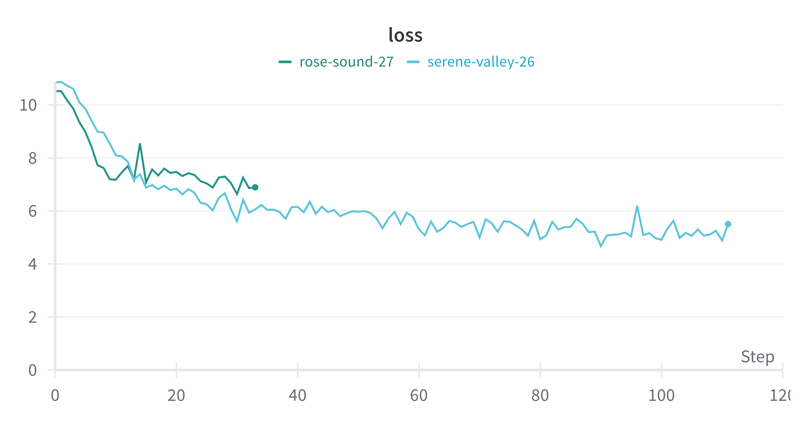

# Mini-LLaMA MLX

A simple implementation of LLaMA 2 that you can run experiments with on your MacBook.

## Setup

- Download the LLaMA 2 tokenizer from [Meta's website](https://llama.meta.com/llama-downloads/)
- Install the required packages by `pip install -r requirements.txt`
- To train the model, run `python train.py`. The training configuration is in the `TrainerConfig` class.
- To use the model, run `python generate.py <checkpoint_path> <prompt>`.

## Usage

The default parameter in `train.py` is tuned for a model to train for 30 minutes on an M1 MacBook Air 16GB.  
Here's how to tune it to your own machine:

1. Test the time per iteration for the maximum batch size your machine can fit without increasing the time linearly.
   For me it's batch size 16 at ~1 sec / iteration
1. Divide 128 by the batch size to get your gradient accumulation steps `grad_acc_steps`. For me it's `128 / 16 = 8`
1. Divide 1800 by (the time per iteration * `grad_acc_steps`) to get `n_update_steps`. For me it's `1800 / (1 * 8) = 225`
1. Increase `n_epochs` when the model cannot learn well

## Why Another Implementation

I decided to write another implementation for a couple reasons:

- Try out MLX: MLX is a new framework with clean APIs and has the good features of JAX and PyTorch. I want to try it out.
- Educational: I want to create an example with more modern architectures and techniques. I will also explain the code in detail.
- Lightweight: I want to create something that enables people with limited compute to experiment with language models.
- Simple and hackable: I limit support to reduce code complexity, but the code being simple makes it easy to hack.

## Dataset

Inspired by [LLM-baselines](https://github.com/epfml/llm-baselines),
I chose [WikiText](https://huggingface.co/datasets/wikitext) as the dataset.  
WikiText is small (~100M tokens) but large enough to be interesting.

### Data Preprocessing

WikiText dataset is a collection of articles, and the one Hugging Face Dataset hosts splits it into sentences.  
The largest context-independent body of text is an article,
so I decided to concatenate sentences in the same article and tokenize them with BOS and EOS token added.  
This turned out to be surprisingly difficult to get right.

The title of each article is formatted as `= Title =`, and sections `= = section title = =` or `= = = subsection title = = =`.  
Initially, I applied a heuristic that classifies a sequence as a title if it starts with exactly one `=`,
but turns out game stats in sports are formatted in the same way as titles are: `= Win ; D =`.  
As I add more and more heuristics, I found more and more edge cases.

After further inspection of the data, I found that every title is prepended with 2 empty sentences.
Checking if a title-like sentence has 2 empty sentences did the trick.

I learned 2 lessons:
- It's difficult to preprocess the dataset perfectly, especially when we scale up the dataset size.
- It's important to inspect data.

Data correctness cannot be overlooked because data is the upper bound of a model's performance.

### Creating a Data Batch

The goal is to tokenize the list of sequences and split them into blocks (inputs + labels) for the model to ingest.
Concretely, block size `blk_size = seq_len + 1`, where input length is `seq_len` and `1` is for the autoregressive label.

A sequence is usually not a multiple of `blk_size`, so we have to do something to the tokens that cannot form a full block.
Here I chose to pad a sequence to a multiple instead of truncation to maximize the data usage.

After ensuring the sequence is a multiple of `blk_size`, we split the sequence into a batch of sequences of length `blk_size`.
In the end, we will process the dataset into a batch of sequences of length `blk_size`.

To iterating over the data, we index the first axis and increment by `bsz`, where `bsz` is the batch size.  
We count the number of steps independently from the iteration index
because `n_steps` may be larger or smaller than the total number of batches in the dataset.

### Epochs

I realized that it is difficult for a small model to learn well with little data.  
Due to limited compute, I decided to make the model overfit on small amount of data by repeating it.

`n_epochs` specifies how many times a batch will be trained on the model.  
This hyperparameter changes the dataset size in order to maintain the same amount of compute.  
Specifically, `n_seqs = (bsz * n_steps) // n_epochs`,
where `bsz * n_steps` is the total number of batches the models sees throughout the whole training.

## Model

Model is the most flashy part of the code.  
The LLaMA I implemented here is unfortunately LLaMA 2 without grouped-query attention,
but the architecture will be the same as LLaMA 3 if we replace attention with GQA.

### Notation

I adopted the [shape suffix notation](https://medium.com/@NoamShazeer/shape-suffixes-good-coding-style-f836e72e24fd).  
Every tensor variable is suffixed with its dimensions.

| Name | Description |
| :-: | :- |
| V | Vocabulary size |
| D | Embedding dimension |
| N | Heads dimension |
| T | Sequence dimension |
| H | Head embedding size |
| C | Hidden dimension for feed forward nets |
| B | Batch dimension |

### Self Attention

There are so many tutorials on this so I'll be brief here.
Self attention does the following:

1. Project an input embedding into 3 attention matrices: Q, K, and V
1. Split the embedding dimension into multiple heads
1. Apply rotary positional embeddings to query and key matrices
1. Perform scaled dot product attention
1. Flatten the head dimensions of the output embedding and project it to output

A few things I would like to note about my implementation:

- Projecting QKV with one large linear layer is inspired by
  [Andrej Karpathy's NanoGPT](https://github.com/karpathy/nanoGPT/blob/325be85d9be8c81b436728a420e85796c57dba7e/model.py#L56).
  It uses the property that in $y = Wx$ each row of $W$ is independent, so 3 projections can be concatenated into one.
- Splitting attention heads is basically moving N (the head dimension) to outer dimensions for parallelization.

#### Causal Masking

An attention layer generates predictions for **every** token.
Because the model is learning to predict tokens based on previous ones (causal language modeling),
for every token `i`, we need to stop the model from attending (giving a relation score) to tokens `i + 1` to `seq_len`.  
We achieve this by masking the softmax scores of those tokens in the scaled dot production attention with `mask_TT`.

`mask_TT` is passed in as an argument because `T` can change when the model is inferencing.

### Feed Forward Network

A feed forward network consists of 2 linear projections and a SwiGLU activation.

#### Hidden Dimension

Following the LLaMA paper, I set the hidden dimension to $4d \times \frac{2}{3}$, where $d$ is the input dimension.  
In [Meta's implementation](https://github.com/meta-llama/llama/blob/b8348da38fde8644ef00a56596efb376f86838d1/llama/model.py#L332),
they additionally rounded the number up to a multiple of 256.

#### SwiGLU

SwiGLU inherits from many different components.

GLU ([Gated Linear Units](https://paperswithcode.com/method/glu)) proposes $GLU(a, b) = \sigma(a) \otimes b$

[Swish-1](https://paperswithcode.com/method/swish), aka SiLU (Sigmoid-weighted Linear Unit),
is the activation function $Swish_1(x) = x \cdot \sigma(x)$

[SwiGLU](https://paperswithcode.com/method/swiglu) combines the two: $SwiGLU(x) = Swish_1(x W_1) \otimes (x W_2)$

### Model

One thing I would like to talk about is how Transformers make predictions when training.  
Unlike during inference, Transformers make `seq_len` predictions, where every prediction `i` is based on tokens `0` to `i - 1`.
This is why we need `seq_len + 1` tokens for creating labels: the last token needs a label as well.

Every prediction is independent, so we can calculate the loss for every prediction
and average across both the batch and the sequence dimensions.

We also have to remove predictions for pad tokens.
We do this with a mask, zeroing out tokens predictions whose inputs are pad tokens.
We can also use the mask to count the number of non-pad-token predictions, which is useful for averaging the loss.

## Training

Now we get to train some models and stare at the loss plot.
Here is my [WAndB project](https://wandb.ai/kimbochen/mini-llama-mlx) for reference.

### Weight Initialization

Weight initialization is important. It dictates how smoothly your model starts.

> Initialized (light blue) vs. randomly initialized (green)

- [Pythia](https://arxiv.org/abs/2304.01373) and [GPT-NeoX-20B](https://arxiv.org/abs/2204.06745) both cited GPT-J-6B for the intialization method,
  but I cannot find it in the Mesh Transformer repo. However, GPT-NeoX repo provides implementations
  [here](https://github.com/EleutherAI/gpt-neox/blob/01657aa243aed07701660a2dd486434349daa72e/megatron/model/init_functions.py).
- I adopted the initialization of [PaLM](https://arxiv.org/abs/2204.02311v5) because the model architecture is more similar.

The weight initialization scheme is as follows:

- Linear layers are initialized with a normal distribution of mean 0 std $\displaystyle \frac{1}{\sqrt{n}}$,
  where $n$ is the input dimension
- The input embedding layer is initialized with a standard normal distribution (mean 0 std 10)
- RMSNorm layers are initialized with constants 1

### Learning Rate Scheduling

I implemented a standard linear warmup + cosine decay learning rate schedule.
I use 10% - 15% of total update steps for warmup.

### Gradient Accumulation

I decided to implement gradient accumulation to improve the gradient quality, but it makes code a little more complex.  
Here I clarify some terminologies:

| Term | Definition | Formula |
| :- | :- | :- |
| `n_update_steps` | The number of steps we perform a gradient update | |
| `grad_acc_steps` | The number of steps we accumulate gradients | |
| `n_steps` | The total number of steps | `n_steps = n_update_steps * grad_acc_steps` |
| `warmup_raio` | The ratio of warmup steps over the number of update steps | |
| `warmup_steps` | The number of warmup steps | `warmup_steps = n_update_steps * warmup_raio` |

Command line logs every step, while WAndB only logs every update step to make the learning rate and the loss curves easier to interpret.

## Generation

This code focuses on training, so I did not do anything fancy for generation.  
In terms of sampling, I select the token with greatest probability (greedy sampling).  

Unlike training, where cross entropy loss trains the model to select the label token,
we sample a token based on the probability distribution the model predicts,
meaning that we might select the second or third choice tokens with some probability.

One way to modulate the probability distribution is to set the temperature[^1].  
Temperature is a factor that we multiply with the logits to sharpen or flatten the probability distribution.  
I personally find the formation indirect[^2], so here's the result:
**The larger the temperature, the more chaotic the prediction (higher chance of selecting low-probability tokens).**  
A special case is that when temperature is 0, it reduces to greedy sampling.

- [This website](https://lukesalamone.github.io/posts/what-is-temperature/) has nice interactive plots for temperature
- [This blog from Allen NLP](https://blog.allenai.org/a-guide-to-language-model-sampling-in-allennlp-3b1239274bc3) explains
  more advanced techniques such as top-k and top-p sampling

[^1]: The terminology is inspired by [Boltzmann distribution](https://en.wikipedia.org/wiki/Boltzmann_distribution),
     but I don't find it helpful for gaining intuition.
[^2]: Temperature T is in (0.0, 1.0], we **divide** the logits by T,
     so higher T --> **smaller** logits --> flatter distribution --> more chaotic distribution.
     Since we are dividing, T cannot be zero, so we have to treat 0 as a special case when implementing.

## Future Goals

Here are some things I would do if I have more time.
I might do it in PyTorch in the future because my MacBook Air is still too compute-constrained to develop on.

- Inference: There are many interesting inference optimizations, including KV cache, speculative decoding, Medusa
- Efficiency training: I would love to test out small-scale mixture of experts and mixture of depths models
